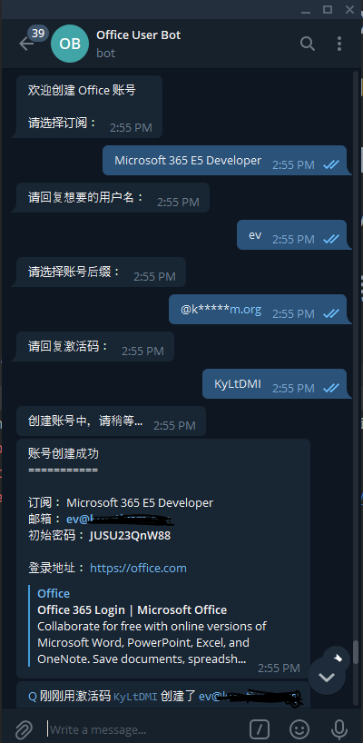
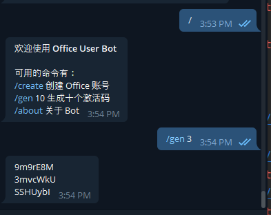

# 🍼 `office-user-bot`

[](https://forthebadge.com)

## 🐙 用 Telegram bot 创建 Office 账号




### 🥼 环境

```
python 3.6+
```

### 💢 用法

#### 1. 在 @botfather 新建 bot

#### 2. 下载项目

```
git clone https://github.com/zayabighead/office-user-bot.git
cd office-user-bot
pip install -r requirements.txt
```

#### 3. 同目录下新建 `config.json` 并如下编辑

```
{
  "bot": {
    "admin": bot 管理员，填 tg 的用户 id,
    "notify": true / false 是否接受新建账号时的推送,
    "token": "bot 的 token，从 botfather 获取"
  },
  "aad": {
    "clientId": "aad app 的 client id",
    "clientSecret": "aad app 的 client secret",
    "tenantId": "aad app 的 tenant id"
  },
  "office": {
    "subscriptions": [
      {
        "name": "订阅显示名称",
        "sku": "订阅 id"
      }
    ],
    "domains": [
      {
        "display": "@******.org 仅供显示域名",
        "value": "@abcde.org 实际域名"
      }
    ]
  },
  "banned": {
    "tgId": [要拉黑的 tg 用户的 id],
    "officeUsername": [
      "admin",
      "用户名黑名单"
    ]
  }
}
```

#### 4. 运行

```
python bot.py
```

输入任意消息 bot 即会回复

生成的激活码保存在同目录下的 `codes.json`